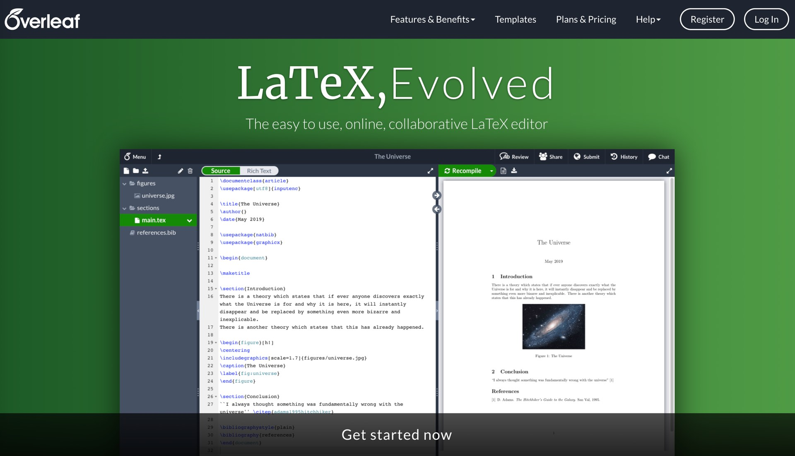
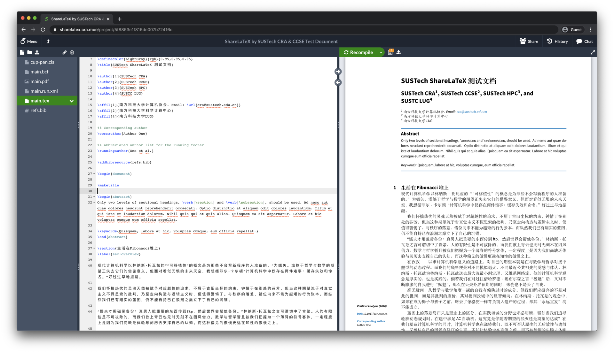
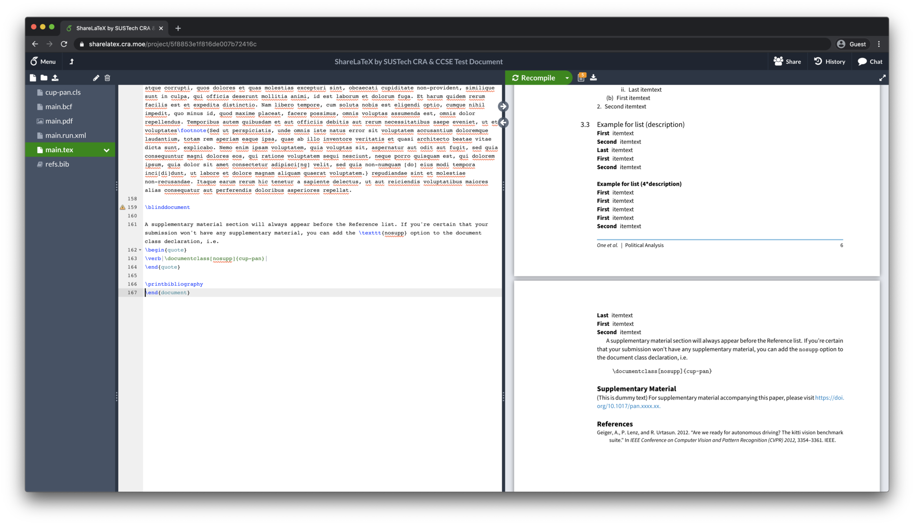

# CRA-ShareLaTeX-妈妈再也不用担心我的 Overleaf 掉线了

[The English version is in the second part of the article.](#Introducing CRA-ShareLaTeX: The Self-hosted Overleaf on Campus)

相信对每一位南科大的同学来说LaTeX都不陌生，在许多工科课程上，你都能听到他的名字。作为一门排版语言，Latex在数学/工程领域应用颇广，但由于Latex的复杂编译程序，中文支持问题和动辄好几G的软件空间，让不少同学望而却步。往往是纸上写好公式，编译好几个小时。

> **LaTeX**，是一种基于[TEX](https://zh.wikipedia.org/wiki/TeX)的[排版](https://zh.wikipedia.org/wiki/排版)系统，由[美国](https://zh.wikipedia.org/wiki/美国)[计算机科学](https://zh.wikipedia.org/wiki/计算机科学)家[莱斯利·兰伯特](https://zh.wikipedia.org/wiki/莱斯利·兰伯特)在20世纪80年代初期开发，利用这种格式系统的处理，即使用户没有排版和程序设计的知识也可以充分发挥由TEX所提供的强大功能，不必一一亲自去设计或校对，能在几天，甚至几小时内生成很多具有书籍质量的印刷品。对于生成复杂表格和[数学](https://zh.wikipedia.org/wiki/数学)公式，这一点表现得尤为突出。因此它非常适用于生成高印刷质量的[科技](https://zh.wikipedia.org/wiki/科技)和[数学](https://zh.wikipedia.org/wiki/数学)、[物理](https://zh.wikipedia.org/wiki/物理)文档。这个系统同样适用于生成从简单的信件到完整书籍的所有其他种类的文档。

在线LaTeX编辑器[Overleaf](https://www.overleaf.com/project)的出现解决了本地LaTeX的许多问题，它能让写作者直接通过浏览器编辑LaTeX代码，并提供“所见即所得”的即时编译结果。

可惜的是，在学校访问互联网上的Overleaf还是会出现访问缓慢，掉线等连接上的问题。同时，免费版的overleaf也**无法实现多人协作（如下图，能够支持10人协作的账号收费15USD/月）和文档历史记录等对于团队项目至关重要的feature**。

为了让更多同学体验到LaTeX这门排版语言的魅力，并减少大家使用overleaf的障碍。南科大计算机协会与科学计算中心合作部署的[校内 ShareLaTeX服务](https://sharelatex.cra.moe/)*（sharelatex和overleaf已经合并，两者代指的是同一个服务）*现已上线。本服务基于[sharelatex的开源版本](https://github.com/overleaf/overleaf)部署，并添加了完整的中文支持。

同时，CRA-ShareLaTeX更支持不限人数的协作和不限制时间的文档编译，以优化同学们在撰写group project时的使用体验。

## 如何体验

由于软件的限制，CRA-ShareLaTeX暂时无法开放自助注册。**如果您想体验CRA-ShareLaTeX，请您发送一封主题为“sharelatex测试”的邮件至[service@cra.moe](mailto:service@cra.moe)。我们将会在第一时间给您发送开通的确认邮件。**

如果您对这项服务有任何疑问或是需要帮助，也欢迎您发邮件至[service@cra.moe](mailto:service@cra.moe)。

## 参考

- [Overleaf文档](https://www.overleaf.com/learn)

# Introducing CRA-ShareLaTeX: The Self-hosted Overleaf on Campus

The LaTeX is an familiar typesetting language to every student of SUSTech, and you may have heard his name in many engineering courses. As a typesetting language, Latex is widely used in math/engineering fields, but many students are discouraged by Latex's complex compiler configuration, Chinese support issues and Gigabytes of installation packages.

> **LaTeX** ([/ˈlɑːtɛx/](https://en.wikipedia.org/wiki/Help:IPA/English) [*LAH-tekh*](https://en.wikipedia.org/wiki/Help:Pronunciation_respelling_key) or [/ˈleɪtɛx/](https://en.wikipedia.org/wiki/Help:IPA/English) [*LAY-tekh*](https://en.wikipedia.org/wiki/Help:Pronunciation_respelling_key)[[1\]](https://en.wikipedia.org/wiki/LaTeX#cite_note-1)), stylized within the system as **LATEX**, is a [software system](https://en.wikipedia.org/wiki/Software_system) for document preparation.[[2\]](https://en.wikipedia.org/wiki/LaTeX#cite_note-Lamport1986-2) When writing, the writer uses [plain text](https://en.wikipedia.org/wiki/Plain_text) as opposed to the [formatted text](https://en.wikipedia.org/wiki/Formatted_text) found in ["What You See Is What You Get"](https://en.wikipedia.org/wiki/WYSIWYG) word processors like [Microsoft Word](https://en.wikipedia.org/wiki/Microsoft_Word), [LibreOffice Writer](https://en.wikipedia.org/wiki/LibreOffice_Writer) and [Apple Pages](https://en.wikipedia.org/wiki/Pages_(word_processor)). The writer uses [markup](https://en.wikipedia.org/wiki/Markup_language) tagging conventions to define the general structure of a document (such as article, book, and letter), to stylise text throughout a document (such as bold and italics), and to add [citations](https://en.wikipedia.org/wiki/Citation) and [cross-references](https://en.wikipedia.org/wiki/Cross-reference). A [TeX](https://en.wikipedia.org/wiki/TeX) distribution such as [TeX Live](https://en.wikipedia.org/wiki/TeX_Live) or [MikTeX](https://en.wikipedia.org/wiki/MikTeX) is used to produce an output file (such as [PDF](https://en.wikipedia.org/wiki/Portable_Document_Format) or [DVI](https://en.wikipedia.org/wiki/Device_independent_file_format)) suitable for printing or [digital distribution](https://en.wikipedia.org/wiki/Digital_distribution).--Wikipedia

The advent of the online LaTeX editor [Overleaf](https://www.overleaf.com/project) solved many of the problems of native LaTeX, allowing writers to edit LaTeX code directly from their browser and preview the rendered document instantly..

Unfortunately, accessing Overleaf on the campus internet still has some issues like slow access speed, dropped connections, and other connectivity issues. **Also, the free version of Overleaf does not allow for multi-person collaboration (as shown below, accounts capable of supporting 10 people collaboration charge 15USD/month) and document history, which are critical features for team projects**.

To allow more students to experience LaTeX as a typographic language and to reduce the barriers to people using it. The [on-campus ShareLaTeX service](https://sharelatex.cra.moe/) (sharelatex and overleaf have been merged to refer to the same service), deployed by the Computer Research Association of SUSTech (CRA) in cooperation with the Center for Computational Science and Engineering (CCSE), is now online. The service is based on [the open source version of sharelatex](https://github.com/overleaf/overleaf), with full Chinese language support and code highligt feature added.

CRA-ShareLaTeX also supports unlimited number of collaborators and unlimited time to compile documents to optimize the students' experience when writing group projects.

## How to use?

Due to software limitations, CRA-ShareLaTeX is currently unavailable for self-registration. **If you would like to try CRA-ShareLaTeX, please send an email with the subject "sharelatex test" to [service@cra.moe](mailto:service@cra.moe). We will send you a confirmation email as soon as possible. **

If you have any questions about this service or need assistance, you are also welcome to send an email to [service@cra.moe](mailto:service@cra.moe).

## Reference

- [Overleaf document](https://www.overleaf.com/learn)
