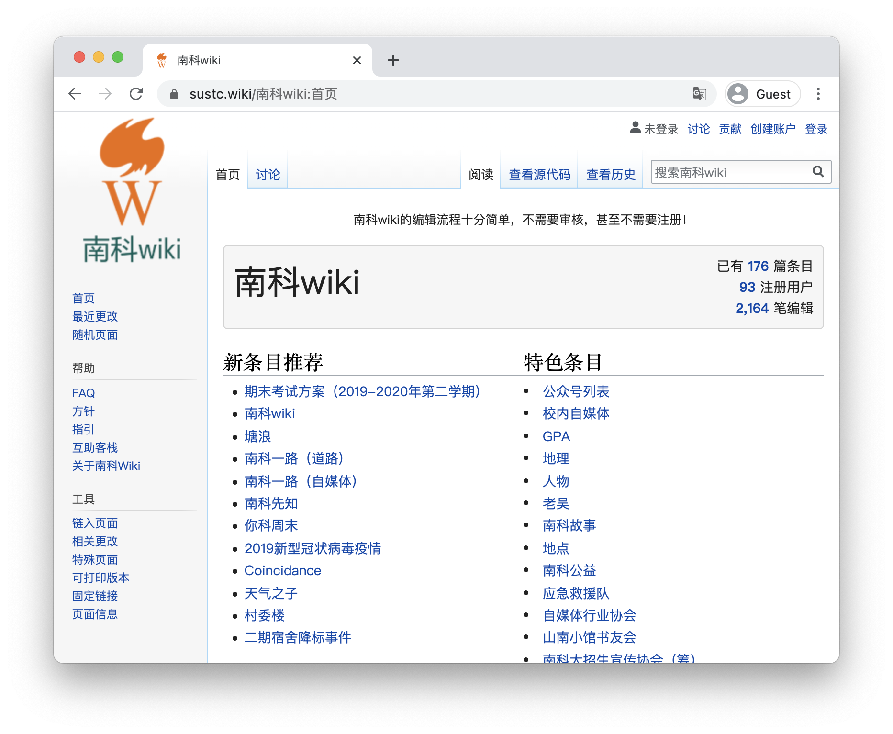

# CRATalk #2 南科wiki：提供知识，记录轶事 Providing knowledge and recording anecdotes

如维基百科的创始人吉米·威尔士所言，维基百科的使命是为每个人提供免费的知识。南科wiki的创始人行到水穷处更说，南科wiki不仅希望为读者提供知识，更希望为同学们提供集合信息与记录学校轶事的平台。

As Jimmy Wales, the founder of Wikipedia, said, the mission of Wikipedia is to provide free knowledge to everyone. 行到水穷处(Xing Dao Shui Qiong Chu), the founder of SUSTC wiki, said that SUSTC wiki not only wants to provide knowledge to readers, but also wants to provide a platform for students to gather information and record school anecdotes.

南科wiki的愿景是什么，如何编写一篇严谨而吸引读者的wiki条目？本次CRA Talk，我们邀请了南科wiki的创始同学行到水穷处，一起讨论南科wiki的过去与可能的未来。

What is the vision of the SUSTC wiki and how to write a rigorous and engaging wiki entry for readers? In this CRA Talk, we invited the founder of SUSTC wiki for discussing the past and possible future of SUSTC wiki together.

（由于他即将毕业，本次CRATalk同时也将是南科wiki的招新宣讲。）

(Since he will be graduating soon, this CRATalk will also be a recruitment talk for the SUSTC wiki.)

## Workshop大纲 TOC

- 南科wiki的愿景
- wiki，维基百科与南科 wiki
- 南科 wiki 的发展历程
- 有趣的条目
- 如何撰写一篇有吸引读者而又不失严谨性的条目

- The vision of SUSTC wiki
- wiki, Wikipedia and SUSTC wiki
- The development of the SUSTC wiki
- Interesting articles
- How to write an article that appeals to readers without losing rigor

## 活动信息 Event Information

- 主讲人：陈宇恒 (行到水穷处)
- 时间：**2021/01/17** 19:00 UTC +08:00
- 活动形式：线下 + 线上会议
  - 地点：一教303
  - 腾讯会议 ID：821 963 124
  - 会议密码：172186

- Speaker：Yuheng Chen (行到水穷处)
- Time: **2021/01/17** 19:00 UTC +08:00
- Event Format: Offline Pre + Online Meeting
  - Venue: Teaching Building 1-303
  - Tencent Meeting ID: 821 963 124
  - Conference Password: 172186

## 参考 Reference

- 南科wiki主页/SUSTC wiki homepage: [https://sustc.wiki/](https://sustc.wiki/)
