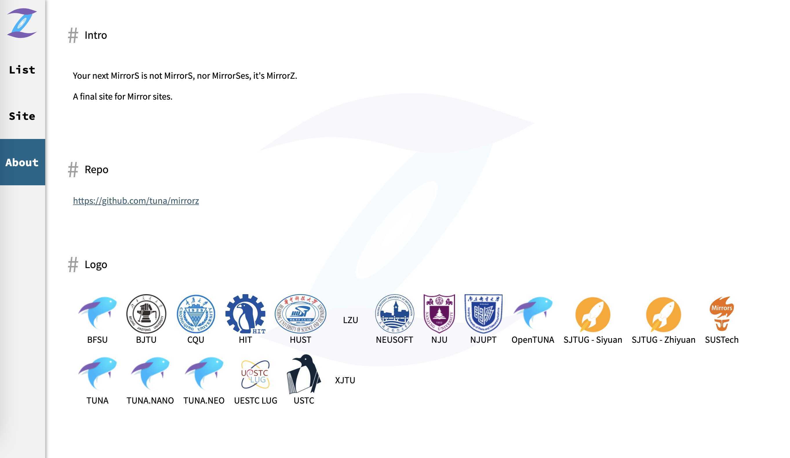

# 南方科技大学开源软件镜像站现已正式开放公网访问


在科学工程计算中心与网络信息中心的支持下，经过近一个月的稳定性测试，南方科技大学开源软件镜像站现已正式开启公网访问。

不论是在校外还是校内，您现在均可以通过 [https://mirrors.sustech.edu.cn/](https://mirrors.sustech.edu.cn/).访问镜像站。

**为节省学校出口带宽，外部访客在访问镜像站时会被限速。限速策略为：单IP最多 3 个并发连接，每个连接传输速度不超过 2000 KB/s。**

With the support of the CCSE and the ITS, the open source software mirror of Southern University of Science and Technology is now officially open for public access.

Whether you are off-campus or on-campus, you can now access the mirror site through [https://mirrors.sustech.edu.cn/](https://mirrors.sustech.edu.cn/).

**In order to save external bandwidth of campus, external visitors will be limited in speed when accessing the mirror site. The speed limit policy is: up to 3 concurrent connections, each with a transfer speed of no more than 2000 KB/s.**

---

如果您在使用镜像站时遇到任何问题，或对镜像服务有任何建议，您可以任选以下方式之一进行反馈：

If you encounter any problems when using the SUSTech Mirrors, or have any suggestions for mirroring services, you can choose one of the following ways to give feedback:

- 在[CRA Commuinty 镜像站板块](https://c.cra.moe/c/cra-service/mirrors/9)留言 Leave a comment at [CRA Commuinty Mirrors Feedback](https://c.cra.moe/c/cra-service/mirrors/9)(（请使用学校邮箱注册/CAS登入 Please use cas to login the forum.)
- 在[https://github.com/sustech-cra/issues/](https://github.com/sustech-cra/issues/)留言。 Open an issue at [https://github.com/sustech-cra/issues/](https://github.com/sustech-cra/issues/).
- Email cra@sustech.edu.cn

---

## 【广告】MirrorZ: 教育网软件源镜像整合站


### 简介

套用一下苹果的广告，Your next MirrorS is not MirrorS, it's MirrorZ. 本项目意在将国内主要镜像的信息整合在一个网站上，满足大家的各种寻找开源软件，系统镜像地址的需求。

网站：[https://mirrorz.org](https://mirrorz.org/)

项目地址：[tuna/mirrorz](https://github.com/tuna/mirrorz)



### 动机

虽然国内的镜像站较多，但是镜像之间是异构的。这个异构并不是指底层的技术栈不同，而是指给用户呈现的内容有所差异，毕竟各个镜像站的选择不同。

举个例子，有一天群友问为啥 TUNA 的 OpenWrt 镜像中没有 snapshot，我们自然解释了[原因](https://github.com/tuna/issues/issues/1076)，但用户真的就没有镜像可以使用了吗？其实还是有的，我们在 https://mirrorz.org/list/openwrt 中逐一寻找，可以发现 HIT 的镜像站中就有 [snapshot 相关镜像](https://mirrors.hit.edu.cn/openwrt/snapshots/targets/)。

另一个例子就是，一位 Arch Linux 用户发现他使用的镜像源同步不太行，准备找个更新一点的镜像，除了去 Arch Linux 官网查找（不是所有镜像都有官网显示镜像同步状态），一种办法自然是去各个镜像站查看状态，但一个个翻镜像实在太困难，有一个整合页面该多好，于是 https://mirrorz.org/list/archlinux 中就有相应状态的显示。

### 状态

目前该项目已经基本可用，已经有了国内多个高校镜像的加入（截至2月28日，已加入mirrorZ的教高校镜像站有：清华大学，北京外国语大学，中国科学技术大学，上海交通大学，东莞理工学院，**南方科技大学**，北京交通大学，南京邮电大学，西安交通大学，同济大学，重庆大学，电子科技大学，哈尔滨工业大学，南京大学，华中科技大学，大连东软信息学院，兰州大学）。

该项目还在火热开发中，更多功能希望大家提出。

mirrorZ更推出「命令行一键换各种源和镜像站测速的脚本」，名为 oh-my-mirrorz，其想法来自 [oh-my-tuna](http://github.com/tuna/oh-my-tuna)，在终端执行`curl https://mirrorz.org/oh-my-mirrorz.py | python3`即可使用。


目前可用的功能（从 url 中基本可以看见所有用法）：

```bash
https://mirrorz.org/
https://mirrorz.org/os/ArchLinux
https://mirrorz.org/app/Git
https://mirrorz.org/font
https://mirrorz.org/list
https://mirrorz.org/list/pypi
https://mirrorz.org/list/%5B0-9%5D%2B
https://mirrorz.org/site
https://mirrorz.org/site/BFSU
https://mirrorz.org/site/OpenTUNA/Y
https://mirrorz.org/about
The following urls are for static webpage, you can use w3m/lynx to view them
https://mirrorz.org/_/
https://mirrorz.org/_/about
More usage of static webpage is documented in the above url
https://mirrorz.org/oh-my-mirrorz.py
Use the above script for speed test!
curl https://mirrorz.org/oh-my-mirrorz.py | python3
```

### 参考

- [MirrorZ: 教育网软件源镜像整合站](https://www.v2ex.com/t/751410)
